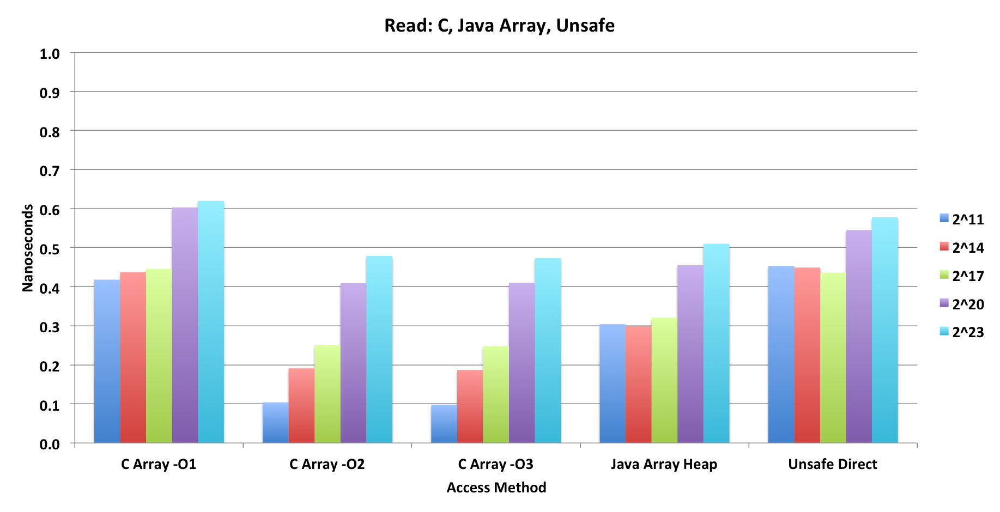
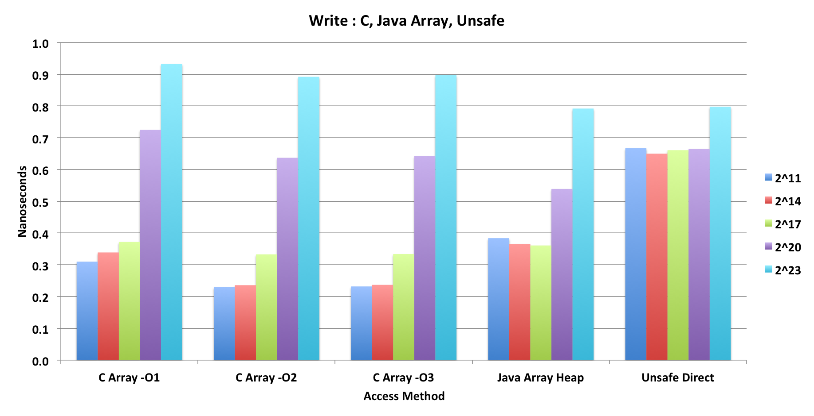
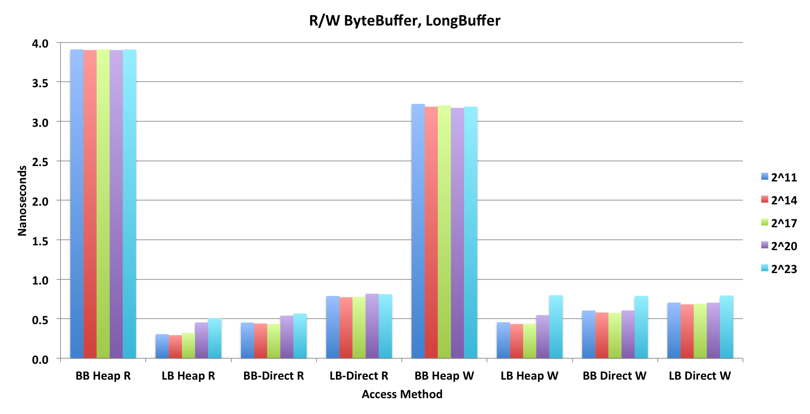

# Memory Performance

## 

The performance tests were very simple: the write test stores longs of 0 to k-1 into arrays of size k where k varied from 2^5 to 2^26.
The read test then read those longs from those arrays. A trial consisted of the tight loop that filled or read the entire array.
Each test of size k was repeated up to millions of times to reduce noise in the measurements.

The inner timing loop for writing into a java array:

      startTime_nS = System.nanoTime();
      for (int i=0; i<arrLongs; i++) { array[i] = i; }
      stopTime_nS = System.nanoTime();

The inner timing loop for reading from that array:

      startTime_nS = System.nanoTime();
      for (int i=0; i<arrLongs; i++) { trialSum += array[i]; }
      stopTime_nS = System.nanoTime();

The trialSum is used as a simple checksum and to make sure the compiler optimizers didn't eliminate the loop.

</img>

</img>

The first 2 figures compares a simple C program with 3 different compiler optimization levels, a java loop with a simple heap array as above, 
and then a java loop using Unsafe accessing on off-heap (Direct) array.

The first myth to be dispelled is that Unsafe is nowhere near as fast as the Java on-heap array access. 
It is 50% slower than Java on-heap, especially for the small array sizes, and 13% slower for the biggest array size. 
This has a lot to due with how efficiently the code can utilize the L1, L2 and L3 CPU caches.
Even if the Unsafe method calls are being replaced with hand-written assembly instructions, 
they are not as effective as the instructions that the JIT compiler emits.

Only in the case of writes to large arrays (> L3 cache) is the Unsafe comparable to the java heap array.

Now look at what the potential is from C. Using just O2 optimization, 
the Java code is 3X slower for reads of small arrays and 65% slower for writes.
Oddly, the C code is slower for the larger arrays, but I'm sure there are tuning options to fix that.

</img>

I also looked at the ByteBuffer and LongBuffer to see how well they would do.

Reading and writing longs with a ByteBuffer is unbelievably horrible. 
Even though the Endianness is set correctly to native, the code emitted is not taking proper advantage of the
underlying Unsafe calls and likely disassembling the longs into bytes on the java side! 

What is really good is that the LongBuffer Heap Reads are very comparable to the Java array reads,
but slower on the writes.
For direct access the Unsafe reads and writes are faster than the LongBuffer direct.

### Measurement System
  Model Name:	MacBook Pro 
  Model Identifier:	MacBookPro10,1 
  Processor Name:	Intel Core i7 
  Processor Speed:	2.6 GHz 
  Number of Processors:	1 
  Total Number of Cores:	4 
  L2 Cache (per Core):	256 KB 
  L3 Cache:	6 MB 
  Memory:	16 GB 1600 MHz DDR3