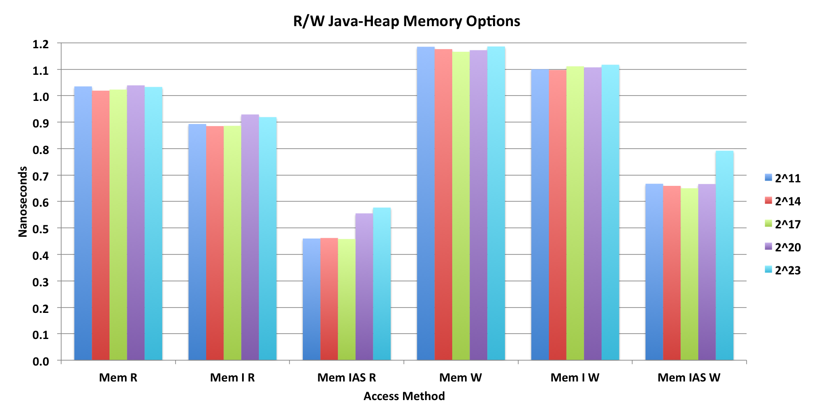
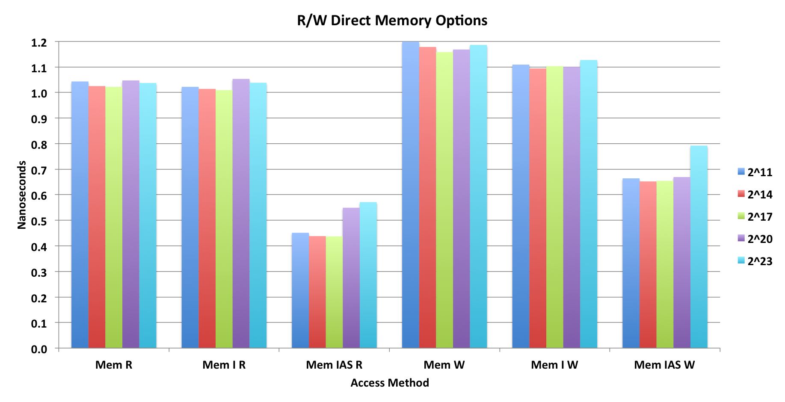

# Memory Performance

## Results Summary

The performance tests were very simple: the write test stores longs of 0 to k-1 into arrays of size k where k varied from 2^5 to 2^26.
The read test then reads those longs from those arrays. A trial consisted of the tight loop that filled or read the entire array.
Each test of size k was repeated up to millions of times to reduce noise in the measurements.

The inner timing loop for writing into a java array:

      startTime_nS = System.nanoTime();
      for (int i=0; i<arrLongs; i++) { array[i] = i; }
      stopTime_nS = System.nanoTime();

The inner timing loop for reading from that array:

      startTime_nS = System.nanoTime();
      for (int i=0; i<arrLongs; i++) { trialSum += array[i]; }
      stopTime_nS = System.nanoTime();

The trialSum is used as a simple checksum and to make sure the compiler optimizers didn't eliminate the loop.

</img>

</img>

The first 2 figures compares a simple C program with 3 different compiler optimization levels, a java loop with a simple heap array as above, 
and then a java loop using Unsafe accessing on off-heap (Direct) array.

The first myth to be dispelled is that "Unsafe is as fast as Java on-heap access". Nope!
Unsafe is nowhere near as fast as the Java on-heap array access. 
It is 50% slower than Java on-heap, especially for the small array sizes, and 13% slower for the biggest array size. 
This has a lot to due with how efficiently the code can utilize the L1, L2 and L3 CPU caches.
Even if the Unsafe method calls are being replaced with hand-written assembly instructions, 
they are not as effective as the instructions that the JIT compiler emits.

Only in the case of writes to large arrays (> L3 cache) is the Unsafe comparable to the java heap array.

Now look at what the potential is from C. Using just O2 optimization.
The Java code is 3X slower for reads of small arrays and 65% slower for writes.
Oddly, the C code is slower for the larger arrays, but I'm sure there are tuning options to fix that.

</img>

Next I looked at the ByteBuffer and LongBuffer to see how well they would do.

Reading and writing longs with a ByteBuffer is unbelievably horrible. 
Even though the Endianness is set correctly to native, the code emitted is not taking proper advantage of the
underlying Unsafe calls and is likely disassembling the longs into bytes on the java side! 
I consider this a java performance bug.

What is really good is that the LongBuffer Heap Reads are very comparable to the Java array reads,
but slower on the writes.
For direct access the Unsafe reads and writes are faster than the LongBuffer direct.

</img>

</img>

I then looked at the Memory package to see how it would perform.

The first image above is using the Memory package to access on-heap arrays, the second image is for off-heap arrays.
Both images are in two groups of three, the first 3 for reads the second three for writes.

The first cluster of each group of 3 is the current Memory package as coded in the library.

The second cluster is the same code, but with the Interface logic removed. 
This means the compiler does not have to decide between two subclasses of the interface.
This resulted in about a 10% improvement in speed.

The biggest change is making the internal methods static, which achieved an additional 50% improvement in performance.
At this point the performance is comparable to the direct calls to unsafe.  
So the JIT compiler is effectively removing the method calls and the assert statements. 
(I proved this with additional tests not shown.)

The challenge now is to figure out how to modify the Memory package to take advantage of this when speed is really important, 
and not sacrifice the nice features that the package provides.

## Running the Code

The code for this suite of tests is located in com.yahoo.sketches.memory package and the program with main is MemoryPerformance.
This program runs the java based tests.  The C code tests are run separately.

The program is configured in two places:

1. Lines 30 to 36 configure 5 running parameters:
  * LgMinTrials, log-base2 of the minimum number of trials to be run at any single test point, which is an array size in longs.
  * LgMaxTrials, log-base2 of the maximum number of trials to be run at any single test point, which is an array size in longs.
  * LgMinLongs,  log-base2 of the minimum array size, in # of longs, to be tested.
  * LgMaxLongs,  log-base2 of the maximum array size, in # of longs, to be tested.
  * ppo = the number of points per octave (factor of 2).  This determines how fine grained are the array sizes. 
  If ppo = 1, the array sizes will increment by factors of 2:  32, 64, 128, ...
  If ppo = 4, the array sizes will increment by factors of fourth-root of 2 or 2^(1/4).
  If ppo = 0.5 the array sizes will increment by factors of 2^2 or 4:  32, 128, ...
  If plotted on a log-axis, these points will be evenly spaced.
  
2. The actual tests to be run are configured in the go() method, line 869.  Comment out tests that you don't care about. 

The first two tests under go() test the long[] access on heap, and then direct calls to Unsafe.

The next four tests under go() test the ByteBuffer and LongBuffer performance.

The next two tests under go() test the current implementation of the Memory package.

The remaining tests under go() test variations of Memory that is in the FastMemory class in the same package.

The actual timings reflect, of course, the actual R/W time plus some minimal amount of work that I think needs to be done so that the JIT optimizer doesn't eliminate the entire loop. 
For the on-heap long[] array access, it is a simple addition. For the Unsafe it is a simple addition and a shift. 
I have tried putting the effect of the shift into the for loop, but the result was slower.

I don't know how to make the timing loops any simpler! 

So my claim is not that these timings are the *actual* R/W access times but comparison across the different access methods should be relatively correct.

The Excel spreadsheet in the docs folder has all the raw data for all the tests.

## Measurement System
  Model Name:	MacBook Pro 
  Model Identifier:	MacBookPro10,1 
  Processor Name:	Intel Core i7 
  Processor Speed:	2.6 GHz 
  Number of Processors:	1 
  Total Number of Cores:	4 
  L2 Cache (per Core):	256 KB 
  L3 Cache:	6 MB 
  Memory:	16 GB 1600 MHz DDR3